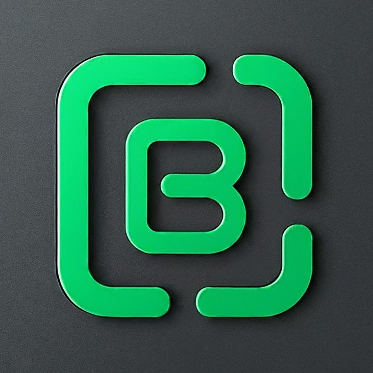

# BinaryBlog
  


<br/>

<div align="center">

</div>

## Description

BinaryBlog is a blog backend api that allows users to create an account, verify their email address, login, create, update, delete blog posts, and search for blog posts.

## Requirements

- Go 1.21.5 and above
- Postgres 13.3 and above
- Docker 20.10.7 and above
- sqlc 1.25.0 and above
- golang-migrate 4.17.0 and above

## Sqlc

```bash
# Docker recommended
docker run --rm -v $(pwd):/src -w /src sqlc/sqlc generate
```
or

Visit [sqlc](https://sqlc.dev/docs/install) to install sqlc

## Usage

```bash
go run cmd/api/blog/main.go [option]
# [option] = 1, 2

# 1: Database migration-up
# 2: Database migration-down

```

> Keep in mind that you need to have a postgres database running on your local machine or in a docker container before running the above command

> leave `[option]` empty to run the server

## Endpoints

- GET /api/v1/health

### Users

<details>
<summary>POST /api/v1/user/signup</summary>
This endpoint allows you to create a new user.
</details>

<details>
<summary>GET /api/v1/user/verify?token={token}</summary>
This endpoint allows you to verify a user's email address.
</details>

<details>
<summary>POST /api/v1/user/login</summary>
This endpoint allows you to login a user.
</details>

<details>
<summary>GET /api/v1/user/{id}</summary>
This endpoint returns a specific user based on the provided ID.
</details>

<details>
<summary>DELETE /api/v1/user/{id}</summary>
This endpoint allows you to delete a specific user based on the provided ID.
</details>

<details>
<summary>GET /api/v1/user/profile</summary>
This endpoint returns the currently logged in user.
</details>

<details>
<summary>PUT /api/v1/user/profile</summary>
This endpoint allows you to update the currently logged in user.
</details>


### Posts

<details>
<summary>GET /api/v1/posts?page={page}
</summary>
This endpoint returns a list of posts with a limit of 10 posts per page. The page query parameter is optional and defaults to 1.
</details>

<details>
<summary>POST /api/v1/posts</summary>
This endpoint allows you to create a new blog post.
</details>

<details>
<summary>GET /api/v1/posts/{id}</summary>
This endpoint returns a specific blog post based on the provided ID.
</details>

<details>
<summary>PUT /api/v1/posts/{id}</summary>
This endpoint allows you to update a specific blog post based on the provided ID.
</details>

<details>
<summary>DELETE /api/v1/posts/{id}</summary>
This endpoint allows you to delete a specific blog post based on the provided ID.
</details>

<details>
<summary>GET /api/v1/article/search?match-type=single&term=python</summary>
This endpoint allows you to search for a blog post based on the provided query parameters where match-type can be single or multi and term is the search term. The default match-type is single.
</details>
